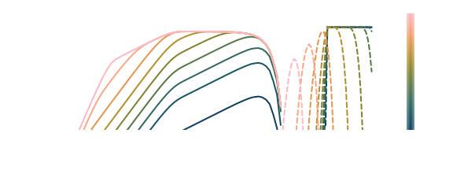
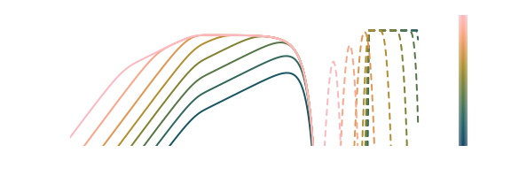
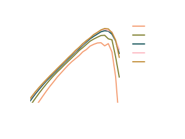

# Tutorial 3: Synchrotron Emissions {#Tutorial-3:-Synchrotron-Emissions}

In this tutorial we will consider a population of electrons undergoing cooling due to a radiation reaction force induced by a magnetic field (just as in [Tutorial 2: Cooling of Electrons via Radiation Reaction](/Overview/Examples/radreact#Tutorial-2:-Cooling-of-Electrons-via-Radiation-Reaction)) but additionally included the emitted population of synchrotron photons. 

::: info

The full code for this tutorial is split into two files, which can be found in `src/examples/Synchrotron/SynchrotronCollisionMatrix.jl` and `src/examples/Synchrotron/SynchrotronTransport.jl`. They can be run inside a Julia REPL using 

```julia

juila> include("SynchrotronCollisionMatrix.jl")
juila> include("SynchrotronTransport.jl")

```


:::

We will explore a few scenarios in this tutorial; first we will compare the cooling and emissions generated by _Diplodocus_ to that from the single-zone code _AM3_ ([Klinger _et al._, 2023](/Overview/Examples/synchrotron#KlingerEtAl_2023)), for this we will use a power-law distribution of electrons which will initially be isotropic, the magnetic field will then be considered both isotropically directed as is in _AM3_ but also uniform to observe the difference that effect makes. Second we will consider the magnetic field to be directed along the rather than isotropically averaged. Plots of the emissions observed by an external observer will then be generated for several observing angles to see the effect that has on the spectrum.

## Building the Gain Collision Matrix {#Building-the-Gain-Collision-Matrix}

Before considering these scenarios, we must first construct the Gain matrix for the emissive process that is synchrotron. Just the same a binary collisions, emissive interactions are managed using the functions contained within the `DiplodocusCollisions` sub-package of `Diplodocus`.  

First step is to define the three particles $1\rightarrow 23$ and the type of emissive process being considered. The particles are defined by a unique three letter `string` ([Particles, Grids and Units](/Overview/conventions#Particles,-Grids-and-Units)) and for emissive interactions particle (1) refers to the incoming particle with (23), in alphabetical order refer to the outgoing emitted particles. The `type` of emissive interaction is defined similarly by a `string`, in this case `sync` for synchrotron.

```julia
    using Diplodocus

    name1::String = "Ele";
    name2::String = "Ele";
    name3::String = "Pho";
    type::String = "Sync";

```


Next thing to do is to setup the momentum-space grids just as in [Tutorial 2: Cooling of Electrons via Radiation Reaction](/Overview/Examples/radreact#Tutorial-2:-Cooling-of-Electrons-via-Radiation-Reaction). For this tutorial we will consider the electron momentum to range from $10^{-3}m_\text{Ele}c$ to $10^{7}m_\text{Ele}c$ consisting of 4 bins per decade. The photon momentum will range from $10^{-20}m_\text{Ele}c$ to $10^{0}m_\text{Ele}c$ consisting of 4 bins per decade and both species will have 15 uniformly sized bins in polar angle cosine and 1 uniformly sized bin in azimuthal angle.

```julia
    p_low_Ele = -3e0
    p_up_Ele = 7e0
    p_grid_Ele = "l"
    p_num_Ele = 80
    u_grid_Ele = "u"
    u_num_Ele = 15
    h_grid_Ele = "u"
    h_num_Ele = 1

    p_low_Pho = -20e0
    p_up_Pho = 0e0
    p_grid_Pho = "l"
    p_num_Pho = 80
    u_grid_Pho = "u"
    u_num_Pho = 15
    h_grid_Pho = "u"
    h_num_Pho = 1
```


Emissive interactions take a vector `Ext` of values as an input that refer to the external parameters that induce the emissive interaction. For synchrotron this is the magnetic field strength taken to be $B=10^{-4}\mathrm{T}$

```julia
    Ext::Vector{Float64} = [1e-4,];
```


Now we define how many points in momentum-space will be sampled by the Monte-Carlo integration procedure, and the range of scale factor used to weight the sampling

```julia
    numLoss = 8*p_num_Pho*u_num_Pho*h_num_Pho
    numGain = 8*p_num_Pho*u_num_Pho*h_num_Pho
    numThreads = 10

    scale = 0.0:0.1:1.0
```


Then define the `fileLocation` where the collision matrices are to be saved and generate the integration `Setup` and `fileName` using the `UserEmissionParameters` function 

```julia
    fileLocation = pwd()*"\\Data"
    (Setup,fileName) = UserEmissionParameters()
```


Finally, we can run the integration using `EmissionInteractionIntegration`.

```julia
    EmissionInteractionIntegration(Setup)
```


## Checking the Gain Matrices {#Checking-the-Gain-Matrices}

Just as is the case with binary collisions, as the integration of the emission matrices relies on Monte-Carlo sampling its accuracy isn&#39;t guaranteed. For Synchrotron, only the gain of photons is calculated as the change in the electron population is evaluated as a radiation reaction force (a complete self consistent description is being worked upon). Therefore we cannot guarantee conservation of energy between these two methods. However, we can check whether the emission spectra of photons exhibits any noise from the sampling process. This can be checked by loading the file using `EmissionFileLoad_Matrix` and using the plotting function `InteractiveEmissionGainLossPlot`, which will display the plot in separate window where it can be interacted with.

```julia
    Output = EmissionFileLoad_Matrix(fileLocation,fileName); 
    InteractiveEmissionGainLossPlot(Output)
```


## Evolving the System Through Phase Space {#Evolving-the-System-Through-Phase-Space}

With the emission matrix for the synchrotron photons generated, we can start to setup the evolution of the system through phase space via the functions contained within the `DiplodocusTransport` package.

### Phase Space Setup {#Phase-Space-Setup}

We will consider a homogenous cylindrical geometry and evolve the system using a logarithmic grid in time from $t=10^0 [\text{s}]$ to $t=10^{8} [\text{s}]$. These SI values of time can be converted to code units using the function `SIToCodeUnitsTime`.

```julia
    t_up::Float64 = log10(SIToCodeUnitsTime(1e8)) # seconds * (σT*c)
    t_low::Float64 = log10(SIToCodeUnitsTime(1e0)) # seconds * (σT*c)
    t_num::Int64 = 8000
    t_grid::String = "l"

    time = TimeStruct(t_up,t_low,t_num,t_grid)

    space_coords = Cylindrical(0.0,0.0,0.0)# x = r, y = phi, z = z

    x_up::Float64 = 1.0
    x_low::Float64 = 0f0
    x_grid::String = "u"
    x_num::Int64 = 1 

    y_up::Float64 = 2.0*pi
    y_low::Float64 = 0.0
    y_grid::String = "u"
    y_num::Int64 = 1
    
    z_up::Float64 = 1.0
    z_low::Float64 = 0.0
    z_grid::String = "u"
    z_num::Int64 = 1

    space = SpaceStruct(space_coords,x_up,x_low,x_grid,x_num,y_up,y_low,y_grid,y_num,z_up,z_low,z_grid,z_num)
```


Next we will define the momentum space grids to match that of our interaction matrix

```julia
    name_list::Vector{String} = ["Ele","Pho"];

    momentum_coords = Spherical() # px = p, py = u, pz = phi

    px_up_list::Vector{Float64} = [7.0,0.0];
    px_low_list::Vector{Float64} = [-3.0,-20.0];
    px_grid_list::Vector{String} = ["l","l"];
    px_num_list::Vector{Int64} = [80,80];

    py_up_list::Vector{Float64} = [1.0,1.0];
    py_low_list::Vector{Float64} = [-1.0,-1.0];
    py_grid_list::Vector{String} = ["u","u"];
    py_num_list::Vector{Int64} = [15,15];

    pz_up_list::Vector{Float64} = [2.0*pi,2.0*pi];
    pz_low_list::Vector{Float64} = [0.0,0.0];
    pz_grid_list::Vector{String} = ["u","u"];
    pz_num_list::Vector{Int64} = [1,1];

    momentum = MomentumStruct(momentum_coords,px_up_list,px_low_list,px_grid_list,px_num_list,py_up_list,py_low_list,py_grid_list,py_num_list,pz_up_list,pz_low_list,pz_grid_list,pz_num_list,"upwind");
```


In this tutorial we don&#39;t have any binary interactions but we do need to include a forcing term for the radiation reaction `SyncRadReact` and an emission corresponding to the synchrotron photons that are emitted `EmiStruct`. We will construct the forcing term just as [Tutorial 2: Cooling of Electrons via Radiation Reaction](/Overview/Examples/radreact#Tutorial-2:-Cooling-of-Electrons-via-Radiation-Reaction), and initially we shall consider the magnetic field to be isotropically averaged, thereby a direct comparison to _AM3_ can be made. For the emission term the struct `EmiStruct` takes six arguments, the first five correspond to particle and external field setup used to generate the collision matrix in the form $"name1","name2","name3","type",Ext$, the last is the `mode` which just like the force term can be either `Ani`, `Axi` or `Iso`.

```julia
    Binary_list::Vector{BinaryStruct} = [];
    Emi_list::Vector{EmiStruct} = [EmiStruct("Ele","Ele","Pho","Sync",[1e-4],Iso())];
    Forces::Vector{ForceType} = [SyncRadReact(Iso(),1e-4),];
```


Now lets collect all the system information within the `PhaseSpace` struct:

```julia
    PhaseSpace = PhaseSpaceStruct(name_list,time,space,momentum,Binary_list,Emi_list,Forces)
```


and build the interaction and flux matrices used internally by the solver

```julia
    DataDirectory = pwd()*"\\Data"  
    BigM = BuildBigMatrices(PhaseSpace,DataDirectory;loading_check=true);
    FluxM = BuildFluxMatrices(PhaseSpace);
```


### Initial Conditions {#Initial-Conditions}

For this tutorial we will initially give the electron population a relativistic power-law distribution with an index of $2$, spanning from a $p$ of $10^{3}m_\text{Ele}c$ to $10^{6}m_\text{Ele}c$. The initial number density of this population will be taken to be $10^6[\text{m}^{-3}]$ which can be generated using the function `Initial_PowerLaw`:

```julia
    Initial_Ele = Initial_PowerLaw(PhaseSpace,"Ele",1e3,1e6,-1.0,1.0,0.0,2.0,2.0,1e6);
```


For the photons, initialy there shouldn&#39;t be any, so we can use `Initial_Constant` with a initial number density of $0.0$:

```julia
    Initial_Pho = Initial_Constant(PhaseSpace,"Pho",1,80,1,15,1,1,0.0)
```


### Running the Solver {#Running-the-Solver}

Let&#39;s quickly setup the `scheme`, `fileName` and `fileLocation` just the same as the previous tutorials

```julia
    scheme = EulerStruct(Initial,PhaseSpace,BigM,FluxM,false)
    fileName = "SyncTest.jld2";
    fileLocation = pwd()*"\\examples\\Synchrotron\\Data";
```


Then run the solver (in this case it will save every 10 time steps):

```julia
    sol = Solve(Initial,scheme;save_steps=10,progress=true,fileName=fileName,fileLocation=fileLocation);
```


## Plotting Results {#Plotting-Results}

We can load the results using 

```julia
    (PhaseSpace, sol) = SolutionFileLoad(fileLocation,fileName);
```


and then plot how the momentum distribution evolves over time using `MomentumDistributionPlot`:

```julia
    MomentumDistributionPlot(sol,["Pho","Ele"],PhaseSpace,step=70,order=2,wide=true,TimeUnits=CodeToSIUnitsTime)
```



 In the above, there are a few options of note, first is that by inputting a vector of strings for the particle species we can plot multiple species on a single plot, seconds is the option `wide=true` which defaults the figure size to a full page width figure for publication in an A4 document. Last is the option for `TimeUnits`, this is a function that tells the plotting function what units to put for time, in this case `CodeToSIUnitsTime` converts all code units to the SI unit of seconds.

### Comparison to AM3 {#Comparison-to-AM3}

The single zone code _AM3_ is quite capable of replicating an identical setup as above. with these initial conditions, the evolution of the electron and photon populations using _AM3_ looks like: 

.

Notice how the _Diplodocus_ and _AM3_ plots are almost identical (as is to be expected) but there are a few subtle differences. _Diplodocus_ shows a steeper cut-off in emissions at low photon momentum. This is due to _Diplodocus_ using an analytic expression for the synchrotron spectra that is valid at all electron momenta, whereas _AM3_ uses an expression that is only true for relativistic electrons. Hence, as the electron cool to sub-relativistic ($p\approx 1$), the _Diplodocus_ spectra are more accurate. The second thing to note is that the electron population in _Diplodocus_ appears to cool faster than that of _AM3_, this could be due to the momentum grid resolution in _Diplodocus_ introducing numerical diffusion.

## Angular Dependent Emissions {#Angular-Dependent-Emissions}

Now that we have considered an isotropically averaged field and have shown that _Diplodocus_ can well replicate an advanced isotropic single-zone code in that regard, let&#39;s consider a directed magnetic field which will induce anisotropic cooling of the electrons and emission of synchrotron photons. 

To do this we will use the same initial conditions as before, i.e. starting with an isotropic population of electron, but this time the radiation reaction force and synchrotron emissions will be set to `Ani` rather than `Iso`. The three arguments set to zero in `space_coords = Cylindrical(0.0,0.0,0.0)` this corresponds to a magnetic field aligned with the $z$ axis of our cylindrical coordinate system.

Therefore the only changes we need to make is to rebuild the parts that are dependent on the emission and force terms and run another simulation: 

```julia
    Emi_list::Vector{EmiStruct} = [EmiStruct("Ele","Ele","Pho","Sync",[1e-4],Ani())];
    Forces::Vector{ForceType} = [SyncRadReact(Ani(),1e-4),];

    PhaseSpace = PhaseSpaceStruct(name_list,time,space,momentum,Binary_list,Emi_list,Forces);  

    BigM = BuildBigMatrices(PhaseSpace,DataDirectory;loading_check=true);
    FluxM = BuildFluxMatrices(PhaseSpace);

    scheme = EulerStruct(Initial,PhaseSpace,BigM,FluxM,false)
    fileName = "SyncAni.jld2";

    sol_Ani = Solve(Initial_Ani,scheme;save_steps=10,progress=true,fileName=fileName,fileLocation=fileLocation);
```


We can now question what flux of photons would an observer see at some distance `ObserverDistance` and at some set of angles `ObserverAngles` to the cylindrical $z$-axis.

```julia
    (PhaseSpace, sol_Ani) = SolutionFileLoad(fileLocation,fileName);
    ObserverFluxPlot(PhaseSpace,sol_Ani,502,[0.1,0.2,0.3,0.4,0.5],1.0,title="hello",TimeUnits=CodeToSIUnitsTime,plot_limits=(-9.5,-1.5,-3,2))
```


The angles are in units of $\pi$ and here taken to be $0.1\pi,0.2\pi,0.3\pi,0.4\pi,$ and $0.5\pi$, the observing distance taken to be $1.0$ and the time of observation is given as the time index of the solution output, here $502$ corresponds to $t=10^5 [\text{s}]$: 

 We can see that emissions are most dominant at and observing angle of $0.5\pi$, this is perpendicular to the direction of the magnetic field and as we started with an isotropic population of electrons and synchrotron emission is dominant for a pitch angle of $\pi/2$ it is as expected.

## Reference {#Reference}
- <a id='KlingerEtAl_2023'></a>
  Klinger, M.; Rudolph, A.; Rodrigues, X.; Yuan, C.; Fichet de Clairfontaine, G.; Fedynitch, A.; Winter, W.; Pohl, M. and Gao, S. (2023). [_AM3: An Open-Source Tool for Time-Dependent Lepto-Hadronic Modeling of Astrophysical Sources_](https://ui.adsabs.harvard.edu/abs/2023arXiv231213371K).
  
