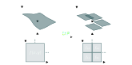

# DIPLODOCUS Framework

::: tip **DIPLODOCUS**

**D**istribution **I**n **PL**ateaux meth**ODO**logy for the comp**U**tation of transport equation**S**.

:::

Diplodocus is a novel framework for evolving the a set of particle distribution functions through the seven dimensions of phase space: one time, three space and three momentum. Evolution includes advection of particles, continuous forcing and discrete interactions (collisions) between particles.

More details of the framework and its numerical implementation can be found in the DIPLODOCUS series of papers, the first two are currently available [EverettCotter_2025](@citet) and [EverettEtAl_2025](@citet)

## Transport Equations for Particles
Transport equations refers to a set of equations that dictate the evolution of particles through phase space. In Diplodocus, that takes the form of an integrated Boltzmann equation: 
```math
\int_{\partial Q} f(\boldsymbol{x},\boldsymbol{p}) \boldsymbol{\omega} = \int_{Q} \boldsymbol{C}(\boldsymbol{x},\boldsymbol{p}),
```
``Q`` is a volume in phase space, ``f(\boldsymbol{x},\boldsymbol{p})`` is the particle distribution function, ``\boldsymbol{\omega}`` is the differential element for hypersurfaces ``\partial Q`` bounding ``Q``, such that ``f(\boldsymbol{x},\boldsymbol{p}) \boldsymbol{\omega}`` measures the fluxes of particles through those boundaries. The integration of ``\boldsymbol{C}(\boldsymbol{x},\boldsymbol{p})`` over the volume ``Q`` then measures the change of particles caused by collisions within ``Q``.

## Distribution-In-Plateaux
To solve the evolution described by the transport equations computationally, a method called "Distribution-In-Plateaux" is used to discretise particle distribution functions. In brief, a continuous distribution over a surface in phase space is divided into a number of plateaux over sub-areas of the surface. The "height" of this plateaux is then taken to be the average value of the continuous distribution over that sub-area. 



This discretisation allows interactions between particles to be pre-computed while simultaneously providing a flexible and conservative numerical scheme for the transport of distribution function through phase space. 

Pre-computation of collision terms is implemented in the `DiplodocusCollisions.jl` package. 

Transport of the distribution functions is handled by the `DiplodocusTransport.jl` package.

Plotting of results is split into a separate package `DiplodocusPlots.jl`.

## Reference
```@bibliography
Pages = ["overview.md"]
```

