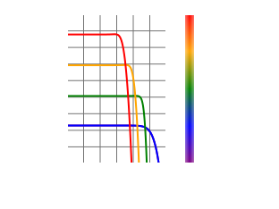
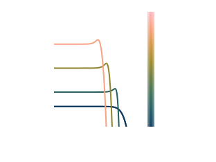
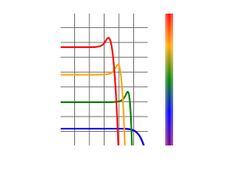
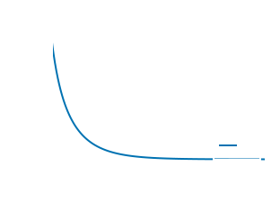
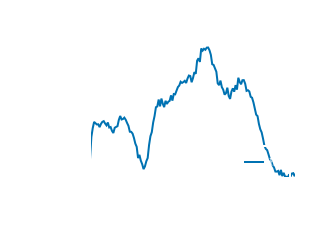
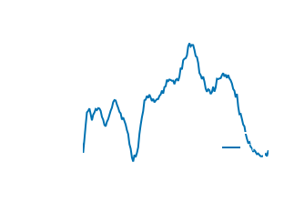
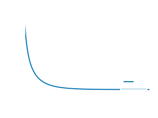

# Tutorial 2: Cooling of Electrons via Radiation Reaction

In this tutorial we will consider a population of electrons which are homogenous in space. This population will undergo cooling due to a radiation reaction force induced by a uniform magnetic field (this force is described in [External Forces](@ref)). 

::: info

The full code for this tutorial can be found in `src/examples/Synchrotron/RadiationReaction.jl`. This can be run inside a Julia REPL using 
```julia

juila> include("RadiationReaction.jl")

```

:::

## Evolving the Electrons Through Phase Space
As radiation reaction is an external force, no collision matrices need to be generated for this tutorial and we can go straight evolving the electron population with the functions contained within the `DiplodocusTransport` package.

For this tutorial we will attempt to reproduce the feature of population inversion studied by [BilbaoEtAl_2024](@citet). They suggest that for a thermal (Maxwell-Juttner) distribution with ``T>\frac{m_\text{Ele}c^2}{3k_B}`` and ``p_\perp\gg p_\parallel`` population inversion should occur. Through their Fig. 2. this should be observable over a timescale of ``\tau=[0,3]``, which for a magnetic field of ``B=10^{-4}\text{T}`` corresponds to ``t\approx 3.6\times10^{-13}\tau`` where ``t`` is in code units. 

### Phase Space Setup
Let's first set up the time and space grids, in the same manor as [Tutorial 1: Evolution of a Population of Hard Spheres](@ref) 
```julia

    tau_to_t::Float64 = 3.644e-13

    t_up::Float64 = 3.0tau_to_t # seconds * (σT*c)
    t_low::Float64 = 0.0tau_to_t # seconds * (σT*c)
    t_num::Int64 = 15000
    t_grid::String = "u"

    time = TimeStruct(t_up,t_low,t_num,t_grid)

    space_coords = Cylindrical()  # x = r, y = phi, z = z

    x_up::Float64 = 1.0
    x_low::Float64 = 0f0
    x_grid::String = "u"
    x_num::Int64 = 1

    y_up::Float64 = 2.0*pi
    y_low::Float64 = 0.0
    y_grid::String = "u"
    y_num::Int64 = 1

    z_up::Float64 = 1.0
    z_low::Float64 = 0.0
    z_grid::String = "u"
    z_num::Int64 = 1

    space = SpaceStruct(space_coords,x_up,x_low,x_grid,x_num,y_up,y_low,y_grid,y_num,z_up,z_low,z_grid,z_num)
```
Then for the momentum grids we expect the peak of the thermal distribution to be around ``p=1 [m_\text{Ele}c]`` so lets add some decent space around that, with 128 bins per decade in momenta, ``u=[-0.001,0.001]`` such that the distribution has an "infantesimal" ``p_\parallel`` population and is dominated by ``p_\perp``. We will also set the number of ``u`` bins to 1 to enforce this.
```julia
    momentum_coords = Spherical()  # px = p, py = u, pz = phi

    px_up_list::Vector{Float64} = [5.0,];
    px_low_list::Vector{Float64} = [-10.0,];
    px_grid_list::Vector{String} = ["l",];
    px_num_list::Vector{Int64} = [1920,];

    py_up_list::Vector{Float64} = [0.001,];
    py_low_list::Vector{Float64} = [-0.001,];
    py_grid_list::Vector{String} = ["u",];
    py_num_list::Vector{Int64} = [1,];

    pz_up_list::Vector{Float64} = [2.0*pi,];
    pz_low_list::Vector{Float64} = [0.0,];
    pz_grid_list::Vector{String} = ["u",];
    pz_num_list::Vector{Int64} = [1,];

    momentum = MomentumStruct(momentum_coords,px_up_list,px_low_list,px_grid_list,px_num_list,py_up_list,py_low_list,py_grid_list,py_num_list,pz_up_list,pz_low_list,pz_grid_list,pz_num_list,"upwind");
```
We are not including any binary or emissive interactions (we are not evolving the photons that are emitted in this tutorial, see Tutorial 3 for that) but we do need to include `SyncRadReact` as the force term. This accepts two arguments, the first is the `mode` which can be either `Ani`, `Axi` or `Iso`. These correspond to different averaging of the force e.g. for `Iso` the force is averaged over all angles, corresponding to a pitch angle averaging of the magnetic field direction. For our case here though we want the field to remain directed so we should choose `Ani`. The second argument `B` indicated the strength of the magnetic field in Tesla, here let's choose ``B=10^{-4}\text{T}``. 
```julia
    Binary_list::Vector{BinaryStruct} = [];
    Emi_list::Vector{EmiStruct} = [];
    Forces::Vector{ForceType} = [SyncRadReact(Ani(),1e-4),];

    DataDirectory = pwd()*"\\examples\\Radiation Reaction\\Data"
    BigM = BuildBigMatrices(PhaseSpace,DataDirectory;loading_check=false);
    FluxM = BuildFluxMatrices(PhaseSpace);
```

### Initial Conditions
We want the initial population of electrons to be a Maxwell-Juttner (thermal) distribution with temperature ``T>\frac{m_\text{Ele}c^2}{3k_B}\approx 2\times10^{9}\text{K}`` to see the population inversion. Let's setup three sets of initial conditions `low`, `med`, and `high`, with intial temperatures around this expected temperature for inversion. We will also use a number density of ``n=1 \mathrm{m}^{-3}``, which won't affect the results as the force is independent of ``n``.
```julia

    function pth_to_T(pth)
        return 5.9e9*pth^2
    end

    Initial_low = Initial_MaxwellJuttner(PhaseSpace,"Ele",pth_to_T(0.5),1,1,1,1,1e0);
    Initial_med = Initial_MaxwellJuttner(PhaseSpace,"Ele",pth_to_T(1.0),1,1,1,1,1e0);
    Initial_high = Initial_MaxwellJuttner(PhaseSpace,"Ele",pth_to_T(1.5),1,1,1,1,1e0);
    low = ArrayPartition(Initial_low,);
    med = ArrayPartition(Initial_med,);
    high = ArrayPartition(Initial_high,);
```

### Running the Solver
We can now run the solver for both sets of initial conditions:
```julia
    fileLocation = pwd() * "/examples/Radiation Reaction/Data/";
    fileName_low = "RadReact_low.jld2";
    fileName_med = "RadReact_med.jld2";
    fileName_high = "RadReact_high.jld2";

    scheme = EulerStruct(low,PhaseSpace,BigM,FluxM,false)
    sol_low = Solve(low,scheme;save_steps=1000,progress=true,fileName=fileName_low,fileLocation=fileLocation);

    scheme = EulerStruct(med,PhaseSpace,BigM,FluxM,false)
    sol_med = Solve(med,scheme;save_steps=1000,progress=true,fileName=fileName_med,fileLocation=fileLocation);

    scheme = EulerStruct(high,PhaseSpace,BigM,FluxM,false)
    sol_high = Solve(high,scheme;save_steps=1000,progress=true,fileName=fileName_high,fileLocation=fileLocation);
```

### Loading and Plotting Results
We can load the three simulations using 
```julia 
    (PhaseSpace_low, sol_low) = SolutionFileLoad(fileLocation,fileName_low);
    (PhaseSpace_med, sol_med) = SolutionFileLoad(fileLocation,fileName_med);
    (PhaseSpace_high, sol_high) = SolutionFileLoad(fileLocation,fileName_high);
```
To match Fig 2. of [BilbaoEtAl_2024](@citet), we want to plot the perpendicular component of ``f(\boldsymbol{p})``, which corresponds to an ``order`` of -2:
```julia 
    MomentumDistributionPlot(sol_low,"Ele",PhaseSpace_low,step=50,perp=true,order=-2,plot_limits=((-5.0,1.0),(-4.0,5.0)))
    MomentumDistributionPlot(sol_med,"Ele",PhaseSpace_med,step=50,perp=true,order=-2,plot_limits=((-5.0,1.0),(-4.0,5.0)))
    MomentumDistributionPlot(sol_high,"Ele",PhaseSpace_high,step=50,perp=true,order=-2,plot_limits=((-5.0,1.0),(-4.0,5.0)))
```

We can clearly see the process of population inversion where ``\frac{\partial f(\boldsymbol{p})}{\partial p_\perp}>0`` occurring when the population has sufficient thermal energy.

It is always good to also inspect the energy and number conservation. 
```julia
    FracNumberDensityPlot(sol_low,PhaseSpace_low)
    EnergyDensityPlot(sol_low,PhaseSpace_low)
```

```julia 
    FracNumberDensityPlot(sol_med,PhaseSpace_med)
    EnergyDensityPlot(sol_med,PhaseSpace_med)
```

```julia
    FracNumberDensityPlot(sol_high,PhaseSpace_high)
    EnergyDensityPlot(sol_high,PhaseSpace_high)
```

All three simulations show good particle number conservation, but energy appears to be decreasing exponentially. But this is to be expected! The radiation reaction force is non-conservative, continually decreasing the energy of the electron population!

## Reference
```@bibliography
Pages = ["radreact.md"]
```