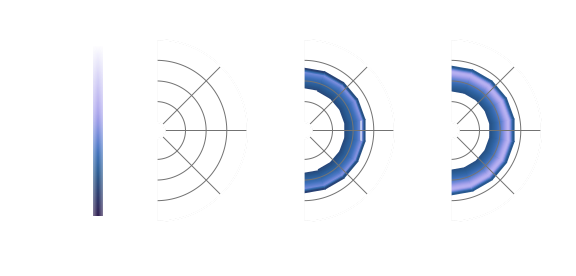
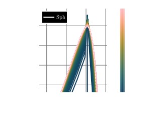
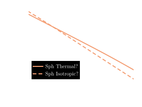
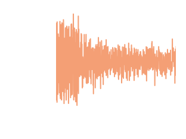
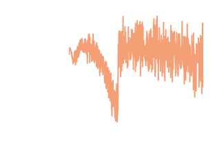

```@meta
EditURL = "../literate_scripts/Tutorial1/tutorial1_plots.jl"
```

# Tutorial 1c: Plotting Results

Now that we've run the simulation, we can use a variety of pre-built plotting functions from `DiplodocusPlots` to plot and analyse the results.

## Load the Simulation Output

First thing to do is load the simulation output using the same `fileLocation` and `fileName` as before:

````julia
using Diplodocus

fileName = "tutorial1_output.jld2"
fileLocation = joinpath(pwd(),"Data")
(PhaseSpace,sol) = SolutionFileLoad(fileLocation,fileName)
````

## Particle Distribution

The particle spectrum as a function of momentum and polar angle can then be plotted using the function `MomentumAndPolarAngleDistributionPlot0D`. All plots take the same three common inputs: the `type` of the plot (lots of plots have `Static` and `Animated` versions), the `PhaseSpace` of the simulation, and the simulation output `sol`. After these three inputs, most plots have some specific required arguments. In this case we will plot a `Static` plot that requires us to specify and abbreviated `species` name in the form of a three letter `String` e.g. `["Sph"]` and three input times (in code units or time steps) in the form of a `Tuple` e.g. `(1,11,1001)`. We can also provide plots with a series of optional keyword argument but for now we will just leave those as their default values.

````julia
PAndUDisPlot = MomentumAndPolarAngleDistributionPlot(Static(),PhaseSpace,sol,["Sph"],(1,11,1001))
````



This shows the "diffusion" of particles in both momentum and angle as a result of the binary interaction between spheres.

To save this plot, we can use the `save` function:

````julia
save("Tutorial1_PAndUDisPlot.svg",PAndUDisPlot)
````

This will save the plot in a `.svg` format in the current working directory.

With the angular dependence, it is hard to interpret the shape of the distribution in momentum from this 2D heatmap. To visualise this spectral shape in momentum we can also plot the angle-averaged distribution using `MomentumDistributionPlot0D`:

````julia
PDisPlot = MomentumDistributionPlot0D(Static(),PhaseSpace,sol,["Sph"];step=10,thermal=true,plot_limits=(-1.4,2.1,-3.4,0.9))
````



With the keyword `step=10` we are only plotting every 10 time steps of the simulation output, and with `thermal=true` the expected shape of a perfect thermal (Mawell-Juttner for massive particles) distribution is over-plotted as a dashed line for comparison.
We can see that as time evolves the spheres approach the thermal distribution, but "over-shoot" at momenta away from the peak, this is linked to numerical diffusion due to the finite bin sizes.

We can also use `IsThermalAndIsotropicPlot0D` to tell us how close we are to the expected thermal and isotropic distribution as a function of time:

````julia
TandIPlot = IsThermalAndIsotropicPlot0D(Static(),PhaseSpace,sol,"Sph")
````



From which we can see that the distribution of hard spheres is exponentially approaching thermalisaion and isotropisation, as was expected.

## Conservation Plots

It is also important to check some convergence statistics. Here we want to check that the total number of particles and energy in the system is conserved. We can plot the fractional change of these properties per time step by using `NumberDensityPlot0D` and `EnergyDensityPlot0D` with the keyword argument `frac=true`. For the energy plot we can also look at the fractional change in energy per particle by setting `perparticle=true`:

````julia
NumPlot = NumberDensityPlot0D(Static(),PhaseSpace,sol,species="Sph";frac=true)
EngPlot = EnergyDensityPlot0D(Static(),PhaseSpace,sol,species="Sph";frac=true,perparticle=true)
````



We can see that for our simulation, particle number and total energy are conserved to the numerical precision of the simulation!

## Animated Plotting

