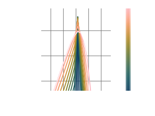
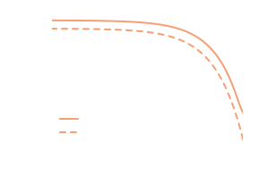
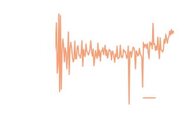

# Tutorial 1: Evolution of a Population of Hard Spheres

---

```@raw html
<video autoplay loop muted playsinline controls src="./assets/HardSphere/HardSphereMomentumComboAnimation.mp4" style="max-height: 60vh;"/>
```

In this tutorial we will consider a population of hard spheres which are homogenous in space. These spheres only interact via perfectly elastic collisions (a binary interaction), the cross section for which is given in [Implemented Collisions](@ref). 

::: info

The full code for this tutorial is split into two files, which can be found in `src/examples/Hard Spheres/HardSphereCollisionMatrix.jl` and `src/examples/Hard Spheres/HardSphereTransport.jl`. They can be run inside a Julia REPL using 
```julia

juila> include("HardSphereCollisionMatrix.jl")
juila> include("HardSphereTransport.jl")

```

:::

## Building the Gain and Loss Collision Matrices

Before any time evolution can be simulated, the collision matrices for the interactions between hard spheres need to be generated using the functions contained within the `DiplodocusCollisions` package. 

First thing is to select the names of the four particles involved in the binary interaction ``12\rightarrow34``. In Diplodocus, each particle is designated a unique three letter `string` to identify it. These unique identifiers are then used internally to define the properties of the particles (please refer to [Particles, Grids and Units](@ref) for more details). In binary interactions, we follow the convention that the pairs of names (12) and (34) should be in alphabetical order. Therefore for the interaction between hard spheres the names are declared by:

```julia
    using Diplodocus

    name1 = "Sph";
    name2 = "Sph";
    name3 = "Sph";
    name4 = "Sph";
```

Next is to define how momentum space is to be discretised for each of particle species. Given that spheres are the only species here, we only need to define the discretisation for them, this includes the upper and lower bounds of momentum magnitude ``p`` (upper and lower bounds for polar angle cosine ``u`` and azimuthal angle ``h`` are not requrired as they are assume to be bounded by ``[-1,1]`` and ``[0, 2\pi]``), grid types (see [Particles, Grids and Units](@ref)) and the number of grid bins. These must be of the format `p_low_name`, `p_low_name`, `p_grid_name`, `p_num_name`, `u_grid_name`, `u_num_name`, `h_grid_name` and  `h_num_name` where `name` is the abbreviated three letter name of the particle species.

For this tutorial we will select the momenta ``p`` ranges from ``10^{-5}m_\text{Ele}c`` to ``10^{4}m_\text{Ele}c`` consisting of 72 bins, 8 uniformly sized bins in polar angle cosine and 1 uniformly sized bin in azimuthal angle (i.e. axisymmetric).

```julia
    
    p_low_Sph = -5.0
    p_up_Sph = 4.0
    p_grid_Sph = "l"
    p_num_Sph = 72

    u_grid_Sph = "u"
    u_num_Sph = 8

    h_grid_Sph = "u"
    h_num_Sph = 1

```

Now we need to define how many times these bins are sampled by the Monte-Carlo integration process. This is defined by three values: `numLoss` defines the number of incoming states (i.e. sets of ``(\vec{p}_1,\vec{p}_2)`` vectors) to sample per incoming state momentum bin, `numGain` defines the number of outgoing states (i.e. ``\vec{p}_3`` and ``\vec{p}_4)``) to sample for each outgoing state bin in momentum space, and `numThreads` defines the number of threads to use (see [the documentation for multi-threading in Julia](https://docs.julialang.org/en/v1/manual/multi-threading/)).

::: tip

The larger `numLoss` and `numGain` are, the more accurate the integration will be, but this will take more time. 

:::

```julia

    numLoss = 16
    numGain = 16
    numThreads = 10

```

Further, for potentially improved integration accuracy, the Monte-Carlo sampling of outgoing states may be weighted by a scale factor. You as the user can set this scale factor as a range `a:b:c` where `a` is its minimum value, `b` is the step size and `c` its maximum value (a multiple of `b`)

```julia

    scale = 0.0:0.1:0.1

```

::: tip

For the first round of integration it is advised to run with a scale of zero i.e. `scale = 0.0:0.1:0.0` as weighting may not be needed for accurate integration. If inaccuracy is found, the scale should be increased gradually. 

:::

Then we need to define the `fileLocation` where the collision matrices are going to be saved to, here we assume that there exists a folder named "Data" located in the current working directory. With this we can also generate the integration `Setup` and `fileName` using the function `UserBinaryParameters` 

```julia
    fileLocation = pwd()*"\\Data"
    (Setup,fileName) = UserBinaryParameters()
```

Finally, we can run the integration using the function `BinaryInteractionIntegration`. 

```julia
    BinaryInteractionIntegration(Setup)
```

::: tip

Even on a good system, integration typically takes several hours if not days. But once it's done the matrices can be used over and over again. So don't worry, and while you wait perhaps sit back, relax and read that book  that's been on your shelf for years just waiting to be read.

:::

## Checking the Gain and Loss Matrices

The evaluation of the collision matrices relies on Monte-Carlo sampling, therefore accuracy isn't guaranteed. There are several functions within Diplodocus to assist with determining if the integration accuracy is sufficient for use. 

The most visual of these is the plotting function `InteractiveBinaryGainLossPlot` from `DiplodocusPlots`. This generates an interactive plot in which the user can vary the incoming and outgoing states, viewing the resulting outgoing spectra in momentum. To use this function, first load the file containing the collision matrices using `BinaryFileLoad_Matrix`:

```julia

    Output = BinaryFileLoad_Matrix(fileLocation,fileName); 
    InteractiveBinaryGainLossPlot(Output)

```

This will display the plot in a separate window in which you can interact with it.

As an example of poor integration, the plots below show a noisy spectra most likely due to insufficient sampling of incoming and outgoing states:


This noise can be reduced by increasing the number of sampling points (i.e. running the integration again with more `numLoss` and `numGain`). With sufficient sampling the spectra should have much less noise, something like this:


Generating good spectra involves a bit of trial and error. It is very easy to tell when a spectra is poor but it may take some practice to get used to how increasing the sampling and adjusting the `scale` effect the results.  

Another way to judge the accuracy of integration is through the `DoesConserve` function. This prints to the terminal a series of statistics about the integration. For the "good" integration this looks like:

```julia

    DoesConserve(Output)

```
```julia-REPL

    sumGainN3 = 31738.51281689529
    sumGainN4 = 0.0
    sumLossN1 = 35806.95116178375
    sumLossN2 = 0.0
    sumGainN = 31738.51281689529
    sumLossN = 35806.95116178375
    #
    sumGainE3 = 9.168965153229928e7
    sumGainE4 = 0.0
    sumLossE1 = 1.1131688197004674e8
    sumLossE2 = 0.0
    sumGainE = 9.168965153229928e7
    sumLossE = 1.1131688197004674e8
    #
    errN = -4068.4383448884582
    errE = -1.9627230437747464e7
    ratioN = 0.8863785322993194
    ratioE = 0.8236814570225856
    #
    mean error in N = 0.04753912150301698
    std of error in  N = 0.13225090463470893
    #
    mean error in E = 0.10008773513522755
    std of error in E = 0.26088913569580185

```
It includes, the total gain and loss of particles as well as the total gain and loss of energy (note as all particles are identical the gain and loss of particles 2 and 4 are neglected as they are identical to 1 and 3). In a perfect integration the total gain and loss of particles and energy would be equal in a binary interaction, but that is not quite possible in Diplodocus as outgoing states that are higher or lower in momenta than the momentum grid bounds are neglected. Nevertheless, the ratio of particles and energy in and out `ratioN` and `ratioE` respectively should be around 1.0 for good integration. These values give a sense of overall convergence but also provided are statistics for individual incoming to outgoing states. For a single incoming state (one set of ``p1,u1,h1,p2,u2,h2`` bins) an error in particle number and energy can be calculated by comparing the loss matrix element for that state to the sum of all outgoing gain matrix elements that correspond to that incoming state. `mean error in N` then gives the mean of that error and `std of error in N` gives the standard deviation. In the case here the mean error is around 5% with a standard deviation of around 10%. That is not bad, but there are two ways to improve this: first is just to increase the sampling by re-running the integration, the second is to scale the outgoing spectra by the ratio of particles lost to gained. The latter method guarantees convergence, but if the spectral shape is noisy may lead to incorrect particle evolution. This method is automatically applied as one of the last steps of integration and is stored as a separate set of matrices in the output. To access them use the `corrected` keyword when loading the file:

```julia 

    Output = BinaryFileLoad_Matrix(fileLocation,fileName,corrected=true); 
    DoesConserve(Output)

```
```julia-REPL

    sumGainN3 = 35806.9511600794
    sumGainN4 = 0.0
    sumLossN1 = 35806.95116178375
    sumLossN2 = 0.0
    sumGainN = 35806.9511600794
    sumLossN = 35806.95116178375
    #
    sumGainE3 = 1.038741922711484e8
    sumGainE4 = 0.0
    sumLossE1 = 1.1131688197004674e8
    sumLossE2 = 0.0
    sumGainE = 1.038741922711484e8
    sumLossE = 1.1131688197004674e8
    #
    errN = -1.7043494153767824e-6
    errE = -7.442689698898345e6
    ratioN = 0.9999999999524017
    ratioE = 0.9331396139814532
    #
    mean error in N = 1.5613294930823843e-16
    std of error in  N = 2.6004433237026757e-16
    #
    mean error in E = 0.09293018304286342
    std of error in E = 0.2672640266499088

```
Now the conversion statistics for particle number are accurate to machine precision.

## Evolving the Spheres Through Phase Space
With a good set of interaction matrices, the evolution of a population of hard spheres can be evaluated using the functions contained within the `DiplodocusTransport` package. 

For this tutorial we will consider the spheres to be initially distributed with momenta ``p`` between ``10^{3}m_\text{Ele}c`` and ``10^{3.1}m_\text{Ele}c``, angles ``u`` between ``-0.25`` and ``0.25`` and angles ``h`` between ``0`` and ``2\pi``. Therefore initially non-thermal and anisotropic, but with zero bulk velocity. Additionally, this population with have a number density ``n=1 \mathrm{m}^{-3}`` and the geometry of the system will be a unit cube, with Cartesian coordinates. With this number density one unit of time in code corresponds to the characteristic mean-free timescale of collisions, so we shall run the simulation for 1000 of these characteristic timescales, with a 15000 logarithmic time steps. 

### Phase Space Setup

Let's now see how to set this up. First we need to set up the domains of space and time, these grids follow the same pattern as the momentum-space discretisation for the collision matrices:

``` julia

    using Diplodocus

    t_up::Float64 = 3.0 # seconds * (σT*c)
    t_low::Float64 = 0.0 # seconds * (σT*c)
    t_num::Int64 = 15000
    t_grid::String = "l"

    time = TimeStruct(t_up,t_low,t_num,t_grid)

    space_coords = Cartesian() # x = x, y = y, z = z

    x_up::Float64 = 0.5
    x_low::Float64 = -0.5
    x_grid::String = "u"
    x_num::Int64 = 1

    y_up::Float64 = 0.5
    y_low::Float64 = -0.5
    y_grid::String = "u"
    y_num::Int64 = 1

    z_up::Float64 = 0.5
    z_low::Float64 = -0.5
    z_grid::String = "u"
    z_num::Int64 = 1

    space = SpaceStruct(space_coords,x_up,x_low,x_grid,x_num,y_up,y_low,y_grid,y_num,z_up,z_low,z_grid,z_num)

```
This generates the `Struct`s used internally to define the geometry of the system, note that as the system in this example is homogenous in space the number of spatial grid cells is set to `1` in each coordinate and the struct `Cartesian()` for the `space_coords` will be default assume periodic boundary conditions.

Next we need to define the particles in the system and their momentum-space grids 

::: warning

Momentum-space grids must match those used in generating the collision matrices

:::

```julia 

    name_list::Vector{String} = ["Sph",];

    momentum_coords = Spherical() # px = p, py = u, pz = phi

    px_up_list::Vector{Float64} = [4.0,];
    px_low_list::Vector{Float64} = [-5.0,];
    px_grid_list::Vector{String} = ["l",];
    px_num_list::Vector{Int64} = [72,];

    py_up_list::Vector{Float64} = [1.0,];
    py_low_list::Vector{Float64} = [-1.0,];
    py_grid_list::Vector{String} = ["u",];
    py_num_list::Vector{Int64} = [8,];

    pz_up_list::Vector{Float64} = [2.0*pi,];
    pz_low_list::Vector{Float64} = [0.0,];
    pz_grid_list::Vector{String} = ["u",];
    pz_num_list::Vector{Int64} = [1,];

    momentum = MomentumStruct(momentum_coords,px_up_list,px_low_list,px_grid_list,px_num_list,py_up_list,py_low_list,py_grid_list,py_num_list,pz_up_list,pz_low_list,pz_grid_list,pz_num_list,"upwind");

```

Now we need to define all the binary interaction, emissive processes and forces acting within the system. For the case here, there is only binary interactions between the spheres:

```julia 

    Binary_list::Vector{BinaryStruct} = [BinaryStruct("Sph","Sph","Sph","Sph")];
    Emi_list::Vector{EmiStruct} = [];
    Forces::Vector{ForceType} = [];

```

All of this system information is then collected within a single `PhaseSpace` struct for passing to the solver.

```julia

    PhaseSpace = PhaseSpaceStruct(name_list,time,space,momentum,Binary_list,Emi_list,Forces);

```

### Building Interaction and Flux Matrices
As many interactions and forces may be present in a system, rather than dealing with a large number of matrices, Diplodocus combines all into three large 2D matrices. Two matrices are for the binary and emissive interactions and one for fluxes (including any forces and fluxes between spatial bins). The action of these matrices on the states of the system defines its evolution. This process is engaged using the `BuildBigMatrices` and `BuildFluxMatrices` functions (note the data directory containing the collision matrices must be specified):

```julia
    DataDirectory = pwd()*"\\Data"
    BigM = BuildBigMatrices(PhaseSpace,DataDirectory;loading_check=true);
    FluxM = BuildFluxMatrices(PhaseSpace);
```
::: tip

`BuildBigMatrices` and `BuildFluxMatrices`, will indicate the size of these matrices in memory. Useful for determining if your system has sufficient memory to run the simulation.

:::

### Initial Conditions
First we need to initialise the state vector `Initial` that will house the initial conditions for all particles species at all positions in space (in this case there is only one particle species and one spatial position).
```julia
    Initial = Initialise_Initial_Condition(PhaseSpace);
```
To fill this state vector there are several functions which can be used to generate different types of initial conditions e.g. `Inital_Constant!`, `Initial_PowerLaw!`, `Initial_MaxwellJuttner!`, etc. For this case we want to use `Initial_Constant!` to modify `Initial` with a distribution that matches our selected initial conditions of: ``p`` between ``10.0m_\text{Ele}c`` and ``13.3m_\text{Ele}c``, angles ``u`` between ``-0.25`` and ``0.25``, angles ``h`` between ``0`` and ``2\pi`` and a number density ``n=1 \mathrm{m}^{-3}``. This can be done as follows:
```julia
    Initial_Constant!(Initial,PhaseSpace,"Sph",pmin=10.0,pmax=13.0,umin=-0.25,umax=0.24,hmin=0.0,hmax=2.0,num_Init=1.0);
```

::: warning

The way bin location are calculated rounds up, i.e. if a value is on a grid boundary then it is placed in the next bin.

:::

### Running the Solver
With all the grids, interactions and initial conditions defined the last thing to do before solving is pick the evolution scheme and deciding where and with what name the solution will be saved. There are only three schemes for time stepping to choose from within the Diplodocus framework, all held within the `EulerStuct`. The first (and only tested option) is the first order "upwind" (or explicit Euler) scheme, chosen by setting the last option in `EulerStruct` to `false`. The second is the first order "downwind" (or implicit Euler) scheme, chosen by setting the last option in `EulerStruct` to `true`. The third is second order leapfrog in time but this is unstable.

::: warning

Implicit time-stepping, is under-development and currently suffers from stability issues due to numerical precision.

:::

Based on this, lets go with explicit time stepping, and store the file with a sensible name in the same location as the collision matrices:

```julia

    scheme = EulerStruct(Initial,PhaseSpace,BigM,FluxM,false)
    fileName = "HardSphere.jld2";
    fileLocation = pwd()*"\\Data";

```

Now lets evolve this system of particles!

```julia

    sol = Solve(Initial,scheme;save_steps=10,progress=true,fileName=fileName,fileLocation=fileLocation);

```

## Plotting Results
First step is to load in the solution file 
```julia 
(PhaseSpace, sol) = SolutionFileLoad(fileLocation,fileName);
```
The particle spectrum can then be plotted as a function of momentum and polar angle at three different times using:
```julia
MomentumAndPolarAngleDistributionPlot(sol,"Sph",PhaseSpace,Static(),(0.0,10.0,1000.0),order=1)
```
where `(0.0,10.0,1000.0)` can either be the times in code units or the time steps, and `order` defines the exponent in the particle spectrum ``p^{order}\frac{\mathrm{d}N}{\mathrm{d}p\mathrm{d}V}``, where `order=1` is default and corresponds to the number density of particles per bin as a function of momentum and polar angle. (`order=2` is the energy density per bin as a function of momentum and polar angle). The resulting plot is:

!!! Missing Plot, does not want to load


This shows the "diffusion" of particles in both momentum and angle as a result of the binary interaction between spheres. Though it may be difficult to interpret the actual shape of the spectrum that is being formed from this 2D heatmap. To get an idea of this spectral shape, we can plot the angle-averaged distribution as a function of momentum:
```julia
MomentumDistributionPlot(sol,"Sph",PhaseSpace,Static(),step=15,thermal=true,order=1,plot_limits=(-0.4,2.4,-2.4,0.9))
```

With the flag `thermal=true` the expected shape of a perfect Mawell-Juttner distribution is over-plotted for comparison. We can see that as time evolves the spheres approach the thermal distribution, but "over-shoot" at momenta away from the peak, this is linked to numerical diffusion due to the finite bin sizes. 

Finally we can plot some statistics to see how well this evolution is converging towards being thermal and isotropic, as well as how well the system conserves particle number and energy density:
```julia
IsThermalAndIsotropicPlot(sol,PhaseSpace)
FracNumberDensityPlot(sol,PhaseSpace)
FracEnergyDensityPlot(sol,PhaseSpace)
``` 

Here we can see the distribution exponentially approaching thermalisation and isotropisation, as expected. Further particle number density is conserved between time steps to numerical precisions, while energy density is constantly increasing but at a slow rate due to it not directly being conserved.

### Animated Plotting
You may have noticed that the the momentum plots take `Static()` as an argument, this tells `DiplodocusPlots.jl` that you would like a generate a publication ready static vector plot. But there is an alternative, if instead you were to replace `Static()` with `Animated()`, rather than a static plot you would get a rendered `.mp4` file of the time evolution. This can be done for both `MomentumAndPolarAngleDistributionPlot` and `MomentumDistributionPlot` individually or you can use the function `MomentumComboAnimation` to plot both at the same time.
```juila 
    MomentumComboAnimation(sol,["Sph"],PhaseSpace;plot_limits_momentum=(-0.2,1.9,-2.1,0.8),filename="HardSphereMomentumComboAnimation.mp4",thermal=true)
```
The resulting animation can be seen at the top of this tutorial.
