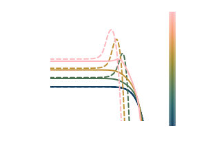
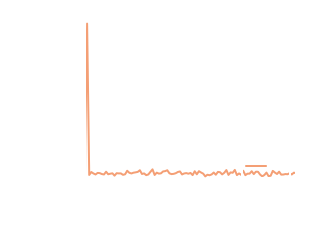
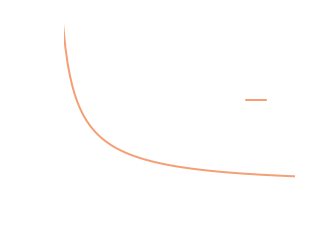

# Tutorial 2: Cooling of Electrons via Radiation Reaction

---

```@raw html
<video autoplay loop muted playsinline controls src="./assets/RadReact/RadReactMomentumComboAnimation.mp4" style="max-height: 60vh;"/>
```

In this tutorial we will consider a population of electrons which are homogenous in space. This population will undergo cooling due to a radiation reaction force induced by a uniform magnetic field (this force is described in [External Forces](@ref)). 

::: info

The full code for this tutorial can be found in `src/examples/Synchrotron/RadiationReaction.jl`. This can be run inside a Julia REPL using 
```julia

juila> include("RadiationReaction.jl")

```

:::

## Evolving the Electrons Through Phase Space
As radiation reaction is an external force, no collision matrices need to be generated for this tutorial and we can go straight evolving the electron population with the functions contained within the `DiplodocusTransport` package.

For this tutorial we will attempt to reproduce the feature of population inversion studied by [BilbaoSilva_2023,BilbaoEtAl_2024](@citet). The cooling of electrons due to a radiation reaction force is non-linear in their momenta and a function of their angle to the magnetic field direction. For an electron propagating perpendicularly to the magnetic field, the characteristic timescale over which it loses its perpendicular momentum is given by ``t_{\perp}=\frac{\mu_0m_ec}{B^2\sigma_T}\frac{1}{\sqrt{p^2+1}}``, where ``p`` is normalised by ``m_ec``, whereas an electron propagating parallel to the magnetic field looses no momentum. ``t_{\perp}`` implies that for relativistic electrons, ``t_{\perp}\propto frac{1}{p}`` while for sub-relativistic electrons ``t_{\perp}\approx {\mu_0m_ec}{B^2\sigma_T}``, independent of their momentum. Therefore if there is a distribution of electrons that's momentum ranges from sub-relativistic to relativistic, the relativistic electrons will cool faster and they will cause a *pile-up* or more technically *Landau population inversion* in the electron distribution defined by ``\frac{\partial f)}{\partial p}>0``. The characteristic time over which this should occur is then ``t={\mu_0m_ec}{B^2\sigma_T}=t_{\text{sync}}`` the characteristic synchrotron timescale.

To explore this we will set up an initial condition of a thermal electron population with its peak around ``p=1 [m_\text{Ele}c]`` such that it contains both sub-relativistic and relativistic populations. We will then evolve that system for one characteristic synchrotron timescale. 

### Phase Space Setup
Let's first set up the time and space grids, in the same manor as [Tutorial 1: Evolution of a Population of Hard Spheres](@ref), but this time also defining a magnetic field strength for the simulation `B` (in Tesla):
```julia

    B = 1e-4;

    t_up::Float64 = SyncToCodeUnitsTime(1.0,B=B) # seconds * (σT*c)
    t_low::Float64 = SyncToCodeUnitsTime(0.0,B=B) # seconds * (σT*c)
    t_num::Int64 = 1000
    t_grid::String = "u"

    time = TimeStruct(t_up,t_low,t_num,t_grid)

    space_coords = Cylindrical()  # x = r, y = phi, z = z

    x_up::Float64 = 1.0
    x_low::Float64 = 0f0
    x_grid::String = "u"
    x_num::Int64 = 1

    y_up::Float64 = 2.0*pi
    y_low::Float64 = 0.0
    y_grid::String = "u"
    y_num::Int64 = 1

    z_up::Float64 = 1.0
    z_low::Float64 = 0.0
    z_grid::String = "u"
    z_num::Int64 = 1

    space = SpaceStruct(space_coords,x_up,x_low,x_grid,x_num,y_up,y_low,y_grid,y_num,z_up,z_low,z_grid,z_num)
```
For the time bounds we have used the function `SyncToCodeUnitsTime` which takes the time in units of ``t_{\text{sync}}`` as an input and returns the equivalent time in code units (it assumes a default B field of 1e-4 unless otherwise specified).

Then for the momentum grids we expect the peak of the thermal distribution to be around ``p=1 [m_\text{Ele}c]`` so lets add some decent space around that, with 32 bins per decade in momenta. The angle bounds will be the whole sphere such that ``u=[-1.0,1.0]`` and ``h=[0,2.0pi]`` with 33 ``u`` bins and only 1 ``h`` bin (the system is axisymmetric so no need to include ``h`` dependence):
```julia
    momentum_coords = Spherical()  # px = p, py = u, pz = phi

    px_up_list::Vector{Float64} = [5.0,];
    px_low_list::Vector{Float64} = [-10.0,];
    px_grid_list::Vector{String} = ["l",];
    px_num_list::Vector{Int64} = [480,];

    py_up_list::Vector{Float64} = [1.0,];
    py_low_list::Vector{Float64} = [-1.0,];
    py_grid_list::Vector{String} = ["u",];
    py_num_list::Vector{Int64} = [33,];

    pz_up_list::Vector{Float64} = [2.0*pi,];
    pz_low_list::Vector{Float64} = [0.0,];
    pz_grid_list::Vector{String} = ["u",];
    pz_num_list::Vector{Int64} = [1,];

    momentum = MomentumStruct(momentum_coords,px_up_list,px_low_list,px_grid_list,px_num_list,py_up_list,py_low_list,py_grid_list,py_num_list,pz_up_list,pz_low_list,pz_grid_list,pz_num_list,"upwind");
```
We are not including any binary or emissive interactions (we are not evolving the photons that are emitted in this tutorial, see Tutorial 3 for that) but we do need to include `SyncRadReact` as the force term. This accepts two arguments, the first is the `mode` which can be either `Ani`, `Axi` or `Iso`. These correspond to different averaging of the force e.g. for `Iso` the force is averaged over all angles, corresponding to a pitch angle averaging of the magnetic field direction. For our case here though we want the field to remain directed so we should choose `Ani`. The second argument `B` indicated the strength of the magnetic field in Tesla, which we have previously defined as ``B=10^{-4}\text{T}``. 
```julia
    Binary_list::Vector{BinaryStruct} = [];
    Emi_list::Vector{EmiStruct} = [];
    Forces::Vector{ForceType} = [SyncRadReact(Ani(),B),];

    DataDirectory = pwd()*"/Data"
    BigM = BuildBigMatrices(PhaseSpace,DataDirectory;loading_check=false);
    FluxM = BuildFluxMatrices(PhaseSpace);
```

### Initial Conditions
We want the initial population of electrons to be a Maxwell-Juttner (thermal) distribution with temperature such that the peak is just above relativistic boundary. For this example we will take the thermal momentum ``p_\text{th}=2``. To set up this thermal distribution we will use the function `Initial_MaxwellJuttner!`:
```julia

    function pth_to_T(pth)
        m = 9.10938356e-31
        c = Float64(299792458)
        kb = 1.380649e-23
        return m*c^2*pth^2/kb
    end
    Initial = Initialise_Initial_Condition(PhaseSpace);
    Initial_MaxwellJuttner!(Initial,PhaseSpace,"Ele",T=pth_to_T(2.0),umin=-1.0,umax=1.0,hmin=0.0,hmax=2.0,num_Init=1.0);
```
where we will also use a number density of ``n=1 \mathrm{m}^{-3}``, which won't affect the results as the force is independent of ``n``.

### Running the Solver
We can now run the solver for both sets of initial conditions:
```julia
    fileLocation = pwd() * "/examples/Data/";
    fileName = "RadReact.jld2"

    scheme = EulerStruct(Initial,PhaseSpace,BigM,FluxM,false)
    sol = Solve(Initial,scheme;save_steps=10,progress=true,fileName=fileName,fileLocation=fileLocation);
```

### Loading and Plotting Results
We can load the three simulations using 
```julia 
    (PhaseSpace, sol) = SolutionFileLoad(fileLocation,fileName);
```

We can examine whether this inverted population has appeared by plotting the component of the distribution function ``f(\boldsymbol{p})`` (which corresponds to an ``order`` of -2), parallel and perpendicular to the magnetic field using the `paraperp` option:
```julia 
    MomentumDistributionPlot(sol,["Ele"],PhaseSpace,Static(),step=33,order=-2,paraperp=true,plot_limits=((-4.0,2.0),(-5.0,1.0)))

```

from which we can clearly see the process of population inversion where ``\frac{\partial f(\boldsymbol{p})}{\partial p_\perp}>0``.

We can also plot the angular dependence of the distribution:
```julia
    MomentumAndPolarAngleDistributionPlot(sol,"Ele",PhaseSpace,Static(),(1,52,102),order=-2,TimeUnits=Diplodocus.DiplodocusPlots.CodeToSyncUnitsTime)
```

where we can see the formation of a *ring* in momentum space as a result of this population pile-up.

It is always good to also inspect the energy and number conservation. 
```julia
    FracNumberDensityPlot(sol,PhaseSpace,TimeUnits=CodeToSyncUnitsTime)
    EnergyDensityPlot(sol,PhaseSpace,TimeUnits=CodeToSyncUnitsTime)
```

The simulation shows good particle number conservation, but energy appears to be decreasing exponentially. However, this is to be expected! The radiation reaction force is non-conservative, continually decreasing the energy of the electron population!

### Animated Plot
We can then also generate the animated plot used at the top of this page using 
```julia
MomentumComboAnimation(sol_high,["Ele"],PhaseSpace_high;plot_limits_momentum=((-4.0,2.0),(-6.0,0.0)),order=-2,thermal=false,paraperp=true,initial=false,filename="RadReactMomentumComboAnimation.mp4",TimeUnits=CodeToSyncUnitsTime)
```

## Reference
```@bibliography
Pages = ["radreact.md"]
```