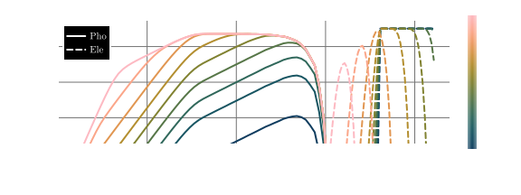
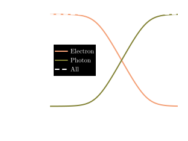

# Tutorial 3: Synchrotron Emissions

---

```@raw html
<video autoplay loop muted playsinline controls src="./assets/RadReact/SyncPDisAnimated.mp4" style="max-height: 60vh;"/>
```

In this tutorial we will consider a population of electrons undergoing cooling due to a radiation reaction force induced by a magnetic field (just as in [Tutorial 2: Cooling of Electrons via Radiation Reaction](@ref)) but additionally included the emitted population of synchrotron photons. 

we will compare the cooling and emissions generated by *Diplodocus* to that from the single-zone code *AM3* [KlingerEtAl_2024a](@citep), for this we will use a power-law distribution of electrons which will initially be isotropic, the magnetic field will also be taken to be isotropic as it is in *AM3*. 

::: info

The full code for this tutorial is split into two files `SynchrotronCollisionMatrix.jl` for generating the emission matrix for the synchrotron emissions and `SynchrotronTransport.jl` for the evolution of the system. Both can be found in `src/examples/Synchrotron/`.

:::

## Building the Gain Collision Matrix

Before considering these scenarios, we must first construct the Gain matrix for the emissive process that is synchrotron. Just the same a binary collisions, emissive interactions are managed using the functions contained within the `DiplodocusCollisions` sub-package of `Diplodocus`.  

First step is to define the three particles ``1\rightarrow 23`` and the type of emissive process being considered. The particles are defined by a unique three letter `string` ([Particles, Grids and Units](@ref)) and for emissive interactions particle (1) refers to the incoming particle with (23), in alphabetical order refer to the outgoing emitted particles. The `type` of emissive interaction is defined similarly by a `string`, in this case `sync` for synchrotron.

```julia
    using Diplodocus

    name1::String = "Ele";
    name2::String = "Ele";
    name3::String = "Pho";
    type::String = "Sync";

```

Next thing to do is to setup the momentum-space grids just as in [Tutorial 2: Cooling of Electrons via Radiation Reaction](@ref). For this tutorial we will consider the electron momentum to range from ``10^{-3}m_\text{Ele}c`` to ``10^{7}m_\text{Ele}c`` consisting of 8 bins per decade. The photon momentum will range from ``10^{-15}m_\text{Ele}c`` to ``10^{7}m_\text{Ele}c`` consisting of 4 bins per decade and both species will have 9 uniformly sized bins in polar angle cosine and 1 uniformly sized bin in azimuthal angle.

```julia
    p_low_Ele = -3e0
    p_up_Ele = 7e0
    p_grid_Ele = "l"
    p_num_Ele = 80
    u_grid_Ele = "u"
    u_num_Ele = 9
    h_grid_Ele = "u"
    h_num_Ele = 1

    p_low_Pho = -15e0
    p_up_Pho = 7e0
    p_grid_Pho = "l"
    p_num_Pho = 88
    u_grid_Pho = "u"
    u_num_Pho = 9
    h_grid_Pho = "u"
    h_num_Pho = 1
```

Emissive interactions take a vector `Ext` of values as an input that refer to the external parameters that induce the emissive interaction. For synchrotron this is the magnetic field strength taken to be ``B=10^{-4}\mathrm{T}``

```julia
    Ext::Vector{Float64} = [1e-4,];
```

Now we define how many points in momentum-space will be sampled per bin by the Monte-Carlo integration procedure, and the range of scale factor used to weight the sampling (as of writing a ``scale\neq0`` for emissive terms has not been implemented)

```julia 
    numLoss = 256
    numGain = 256
    numThreads = 10

    scale = 0.0:0.1:0.0
```

Then define the `fileLocation` where the collision matrices are to be saved and generate the integration `Setup` and `fileName` using the `UserEmissionParameters` function 

```julia
    fileLocation = pwd()*"\\Data"
    (Setup,fileName) = UserEmissionParameters()
```

Finally, we can run the integration using `EmissionInteractionIntegration`.

```julia
    EmissionInteractionIntegration(Setup)
```

## Checking the Gain Matrices

Just as is the case with binary collisions, as the integration of the emission matrices relies on Monte-Carlo sampling its accuracy isn't guaranteed. For Synchrotron, only the gain of photons is calculated as the change in the electron population is evaluated as a radiation reaction force (a complete self consistent description is being worked upon). Therefore we cannot guarantee conservation of energy between these two methods. However, we can check whether the emission spectra of photons exhibits any noise from the sampling process. This can be checked by loading the file using `EmissionFileLoad_Matrix` and using the plotting function `InteractiveEmissionGainLossPlot`, which will display the plot in separate window where it can be interacted with.

```julia 
    Output = EmissionFileLoad_Matrix(fileLocation,fileName); 
    InteractiveEmissionGainLossPlot(Output)
```

## Evolving the System Through Phase Space

With the emission matrix for the synchrotron photons generated, we can start to setup the evolution of the system through phase space via the functions contained within the `DiplodocusTransport` package.

### Phase Space Setup
We will consider a homogenous spherical geometry and evolve the system using a logarithmic grid in time from ``t=10^0 [\text{s}]`` to ``t=10^{8} [\text{s}]``. These SI values of time can be converted to code units using the function `SIToCodeUnitsTime`.

```julia
    t_up::Float64 = log10(SIToCodeUnitsTime(1e8)) # seconds * (σT*c)
    t_low::Float64 = log10(SIToCodeUnitsTime(1e0)) # seconds * (σT*c)
    t_num::Int64 = 400
    t_grid::String = "l"

    time = TimeStruct(t_up,t_low,t_num,t_grid)

    space_coords = Spherical()# x = r, y = theta, z = phi

    x_up::Float64 = 1.0
    x_low::Float64 = 0f0
    x_grid::String = "u"
    x_num::Int64 = 1 

    y_up::Float64 = pi
    y_low::Float64 = 0.0
    y_grid::String = "u"
    y_num::Int64 = 1
    
    z_up::Float64 = 2.0*pi
    z_low::Float64 = 0.0
    z_grid::String = "u"
    z_num::Int64 = 1

    space = SpaceStruct(space_coords,x_up,x_low,x_grid,x_num,y_up,y_low,y_grid,y_num,z_up,z_low,z_grid,z_num)
```

Next we will define the momentum space grids to match that of our interaction matrix

```julia
    name_list::Vector{String} = ["Ele","Pho"];

    momentum_coords = Spherical() # px = p, py = u, pz = phi

    px_up_list::Vector{Float64} = [7.0,0.0];
    px_low_list::Vector{Float64} = [-3.0,-15.0];
    px_grid_list::Vector{String} = ["l","l"];
    px_num_list::Vector{Int64} = [80,88];

    py_up_list::Vector{Float64} = [1.0,1.0];
    py_low_list::Vector{Float64} = [-1.0,-1.0];
    py_grid_list::Vector{String} = ["u","u"];
    py_num_list::Vector{Int64} = [9,9];

    pz_up_list::Vector{Float64} = [2.0*pi,2.0*pi];
    pz_low_list::Vector{Float64} = [0.0,0.0];
    pz_grid_list::Vector{String} = ["u","u"];
    pz_num_list::Vector{Int64} = [1,1];

    momentum = MomentumStruct(momentum_coords,px_up_list,px_low_list,px_grid_list,px_num_list,py_up_list,py_low_list,py_grid_list,py_num_list,pz_up_list,pz_low_list,pz_grid_list,pz_num_list,"upwind");
```

In this tutorial we don't have any binary interactions but we do need to include a forcing term for the radiation reaction `SyncRadReact` and an emission corresponding to the synchrotron photons that are emitted `EmiStruct`. We will construct the forcing term just as [Tutorial 2: Cooling of Electrons via Radiation Reaction](@ref), and initially we shall consider the magnetic field to be isotropically averaged, thereby a direct comparison to *AM3* can be made. For the emission term the struct `EmiStruct` takes six arguments, the first five correspond to particle and external field setup used to generate the collision matrix in the form ``"name1","name2","name3","type",Ext``, the last is the `mode` which just like the force term can be either `Ani`, `Axi` or `Iso`.
```julia
    Binary_list::Vector{BinaryStruct} = [];
    Emi_list::Vector{EmiStruct} = [EmiStruct("Ele","Ele","Pho","Sync",[1e-4],Iso())];
    Forces::Vector{ForceType} = [SyncRadReact(Iso(),1e-4),];
```
Now lets collect all the system information within the `PhaseSpace` struct:
```julia 
    PhaseSpace = PhaseSpaceStruct(name_list,time,space,momentum,Binary_list,Emi_list,Forces)
```
and build the interaction and flux matrices used internally by the solver
```julia
    DataDirectory = pwd()*"\\Data"  
    BigM = BuildBigMatrices(PhaseSpace,DataDirectory;loading_check=true);
    FluxM = BuildFluxMatrices(PhaseSpace);
```

### Initial Conditions
For this tutorial we will initially give the electron population a relativistic power-law distribution with an index of ``2``, spanning from a ``p`` of ``10^{3}m_\text{Ele}c`` to ``10^{6}m_\text{Ele}c``. The initial number density of this population will be taken to be ``10^6[\text{m}^{-3}]`` which can be generated using the function `Initial_PowerLaw`:
```julia
    Initial = Initialise_Initial_Condition(PhaseSpace);
    Initial_PowerLaw!(Initial,PhaseSpace,"Ele",pmin=1e3,pmax=1e6,umin=-1.0,umax=1.0,hmin=0.0,hmax=2.0,index=2.0,num_Init=1e6);
```
For the photons, initially there shouldn't be any, so we don't need to set any initial condition as `Initialise_Initial_Condition` sets all populations to zero when initialising the state vector.

### Running the Solver
Let's quickly setup the `scheme`, `fileName` and `fileLocation` just the same as the previous tutorials
```julia 
    scheme = EulerStruct(Initial,PhaseSpace,BigM,FluxM,false)
    fileName = "Sync.jld2";
    fileLocation = pwd()*"\\Data";
```
Then run the solver (in this case it will save every 5 time steps):
```julia
    sol = Solve(Initial,scheme;save_steps=5,progress=true,fileName=fileName,fileLocation=fileLocation);
```

## Plotting Results
We can load the results using 
```julia
    (PhaseSpace, sol) = SolutionFileLoad(fileLocation,fileName);
```
and then plot how the momentum distribution evolves over time using `MomentumDistributionPlot`:
```julia
    MomentumDistributionPlot(sol,["Pho","Ele"],PhaseSpace,Static(),step=10,order=2,wide=true,plot_limits=((-15.0,7.0),(2.5,9.5)),TimeUnits=CodeToSIUnitsTime)
```

In the above, there are a few options of note, first is that by inputting a vector of strings for the particle species we can plot multiple species on a single plot, seconds is the option `wide=true` which defaults the figure size to a full page width figure for publication in an A4 document. Last is the option for `TimeUnits`, this is a function that tells the plotting function what units to put for time, in this case `CodeToSIUnitsTime` converts all code units to the SI unit of seconds.

We can also generate the animation at the top of the page using by simply changing `Static` to `Animated`:
```julia
    MomentumDistributionPlot(sol,["Ele","Pho"],PhaseSpace,Animated(),thermal=false,order=2,plot_limits=((-15.0,7.0),(2.5,9.5)),wide=true,TimeUnits=CodeToSIUnitsTime,filename="SyncPDisAnimated.mp4")
```
and further we can plot how energy changes between the electron and photon population:
```julia
    EnergyDensityPlot(sol,PhaseSpace,TimeUnits=CodeToSIUnitsTime)
```

As we can see, energy is not quite conserved. This is due to numerical diffusion of the electron population and the way the cooling of electrons and emission of photons are handled within *Diplodocus*. Electrons are cooled by a radiation reaction *force* which is implemented as an analytically integrated force flux, whereas photons are *emitted* via an emission matrix, the terms of which are integrated via a Monte-Carlo method. In the limit of infinite momentum grid resolutions, these two methods converge on perfect energy conservation but there is a difference for finite grids that scales inversely to grid resolution - a scaling factor to counter this effect is under development and will feature in a future version of *Diplodocus*.

## Comparison to AM3

The single zone code *AM3* is quite capable of replicating an identical setup as above. with these initial conditions, the evolution of the electron and photon populations using *AM3* looks like:
.

Notice how the *Diplodocus* and *AM3* plots are almost identical (as is to be expected) but there are a few subtle differences. *Diplodocus* shows a steeper cut-off in emissions at low photon momentum. This is due to *Diplodocus* using an analytic expression for the synchrotron spectra that is valid at all electron momenta, whereas *AM3* uses an expression that is only true for relativistic electrons. Hence, as the electron cool to sub-relativistic (``p\approx 1 ``), the *Diplodocus* spectra are more accurate. The second thing to note is that the electron population in *Diplodocus* appears to cool faster than that of *AM3*, this is due to the momentum grid resolution in *Diplodocus* introducing more numerical diffusion than the finer grid that is used by *AM3*.

## Reference
```@bibliography
Pages = ["synchrotron.md"]
```